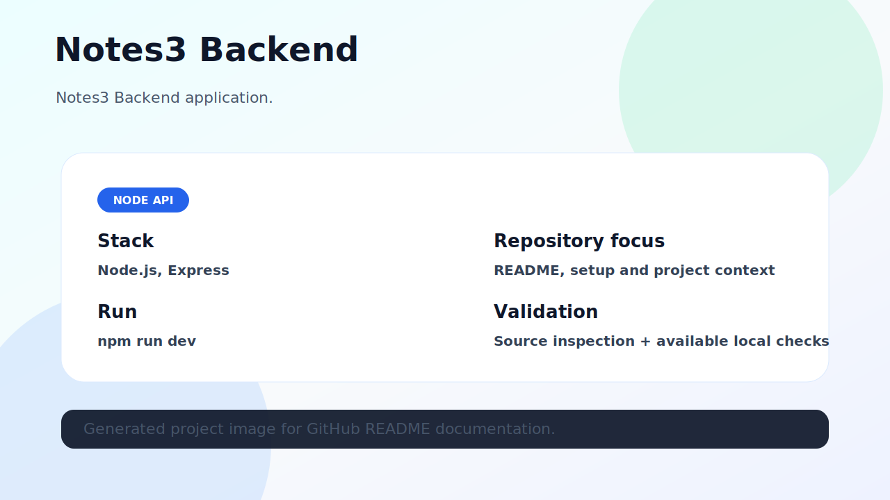

# Notes3 Backend

Notes3 Backend application.



## Stack

- Node.js
- Express

## What this repository contains

This repository contains the source code and documentation for **notes3-backend**. The README was refreshed to make the project easier to understand, run and validate from GitHub.

## Project image

The image above represents the current project state. When a local browser runtime was available, it was captured from the running project; otherwise it is an honest architecture/overview image based on source inspection.

## Getting started

```bash
git clone https://github.com/luisMakesIt/notes3-backend.git
cd notes3-backend
```

### Install dependencies

```bash
npm install
```

### Run locally

```bash
npm run dev
```

## Available scripts / commands

| Command | Description |
| --- | --- |
| `start` | `node index.js` |
| `dev` | `nodemon index.js` |
| `test` | `echo "Error: no test specified" && exit 1` |

## Validation notes

- Source inspection completed.

## Suggested next improvements

- Add automated tests or CI if the project does not have them yet.
- Keep environment-specific values out of version control.
- Document any external services required to run the project locally.
